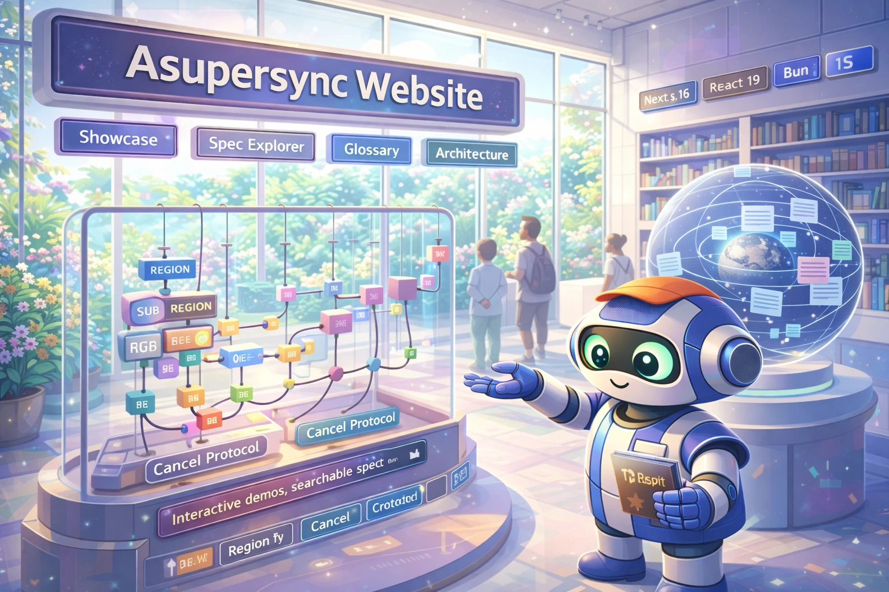

# Asupersync Website

<div align="center">
  

[](https://nextjs.org/)
[](https://react.dev/)
[](https://bun.sh/)
[](https://www.typescriptlang.org/)
[](https://opensource.org/licenses/MIT)

</div>

This is the Next.js 16 website for the Asupersync runtime. It includes interactive concurrency demos, architecture documentation, glossary content, and searchable spec docs.

## Quick Setup (One-Liner)

```bash
git clone <your-repo-url> asupersync_website && cd asupersync_website && bun install && bun dev
```

## TL;DR

**The Problem**: Most runtime project websites are static marketing pages that do not teach the underlying system, so readers leave without understanding how the runtime works.

**The Solution**: The site explains runtime behavior through interactive visualizations and structured docs, so readers can inspect protocol behavior directly.

### Why Use This Project?

| Capability | What You Get |
|---|---|
| **Interactive demos** | 20+ client-side visualizations across cancellation, scheduler behavior, semantics, and security models |
| **Spec Explorer** | Built-in document browser for 26 markdown spec files under `public/spec-docs/` |
| **Structured content model** | Centralized content in `lib/content.ts` and `lib/spec-docs.ts` for maintainable updates |
| **Modern frontend stack** | Next.js 16 App Router + React 19 + strict TypeScript + Tailwind 4 + framer-motion |
| **Performance-aware UX** | Dynamic imports for heavy visualizations, reduced-motion support, and virtualized large lists |
| **Developer discipline** | Bun-only workflows, lint/type gates, beads_rust issue tracking (`br`), and UBS scanning |

## Quick Example

```bash
# 1) Install dependencies
bun install

# 2) Start local development server
bun dev

# 3) Open key pages
#    /showcase       -> interactive demos
#    /architecture   -> architecture deep-dive
#    /spec-explorer  -> searchable spec docs
#    /glossary       -> term explorer

# 4) Run quality checks
bun tsc --noEmit
bun lint

# 5) Build production bundle
bun run build
```

## Design Philosophy

1. **Show, don’t claim**
   The site prioritizes visualized behavior over static prose. If a runtime guarantee is central, it should be demonstrable.

2. **Single-source content**
   Most site data lives in `lib/content.ts` and `lib/spec-docs.ts` to keep edits deterministic and reviewable.

3. **Performance over novelty**
   Heavy components are loaded dynamically and interactive sections respect reduced-motion and practical rendering constraints.

4. **Explicit engineering constraints**
   Bun is required, strict TypeScript is enabled, and checks are expected before release.

5. **Operational clarity**
   Build/test/deploy conventions are straightforward: local verify first, then Vercel deploy flow.

## Comparison

| Dimension | This Project | Typical Marketing Microsite | Plain Markdown Docs |
|---|---|---|---|
| Runtime concept visualizations | ✅ 20+ interactive demos | ⚠️ Usually minimal | ❌ None |
| Searchable in-site spec docs | ✅ Integrated explorer | ❌ Rare | ⚠️ Search depends on host |
| Typed, centralized content model | ✅ Structured TS data | ⚠️ Mixed patterns | ⚠️ Unstructured text files |
| Animation + motion accessibility | ✅ Present | ⚠️ Inconsistent | ❌ N/A |
| Developer quality gates | ✅ Lint + typecheck + UBS workflow | ⚠️ Variable | ⚠️ Variable |

## Installation

### 1) Local Development (Recommended)

```bash
git clone <your-repo-url> asupersync_website
cd asupersync_website
bun install
bun dev
```

### 2) Download + Run (No Git Clone)

```bash
# Replace URL with your repository archive URL
curl -L <repo-archive-url>.tar.gz -o site.tar.gz
tar -xzf site.tar.gz
cd <extracted-directory>
bun install
bun dev
```

### 3) Deploy on Vercel

1. Import the repository in Vercel.
2. Use:
   - Install command: `bun install`
   - Build command: `bun run build`
   - Output directory: `.next`
3. Deploy.

## Quick Start

1. **Install Bun 1.3+**
   Verify with `bun --version`.
2. **Install dependencies**
   Run `bun install` in repo root.
3. **Run the app**
   Start with `bun dev` and open `http://localhost:3000`.
4. **Validate before shipping**
   Run `bun tsc --noEmit` and `bun lint`.
5. **Create production build**
   Run `bun run build`, then `bun start` for local prod smoke testing.

## Command Reference

### Core Scripts (`package.json`)

| Command | Purpose | Example |
|---|---|---|
| `bun dev` | Start Next.js dev server (Turbopack) | `bun dev` |
| `bun run build` | Build production bundle | `bun run build` |
| `bun start` | Run production server | `bun start` |
| `bun lint` | Run ESLint checks | `bun lint` |

### Type Safety + Testing

| Command | Purpose | Example |
|---|---|---|
| `bun tsc --noEmit` | Full TS typecheck without output | `bun tsc --noEmit` |
| `bunx playwright test` | Run E2E tests (if configured) | `bunx playwright test` |
| `bunx playwright install` | Install Playwright browsers | `bunx playwright install` |

### Issue Tracking (`br` / beads_rust)

| Command | Purpose | Example |
|---|---|---|
| `br ready --json` | Show ready/unblocked work | `br ready --json` |
| `br create ... --json` | Create issue | `br create "Improve glossary UX" -t feature -p 1 --json` |
| `br update <id> --status in_progress --json` | Claim work | `br update bd-123 --status in_progress --json` |
| `br close <id> --reason ... --json` | Close work item | `br close bd-123 --reason "Done" --json` |
| `br sync --flush-only` | Export beads state to JSONL | `br sync --flush-only` |

### UBS

| Command | Purpose | Example |
|---|---|---|
| `ubs <path>` | Bug scan specific scope | `ubs . --only=js` |

## Configuration

### `next.config.ts`

```ts
import type { NextConfig } from "next";

const nextConfig: NextConfig = {
  images: {
    formats: ["image/webp"], // prefer modern image format
  },
  compress: true,             // gzip/brotli compression
  poweredByHeader: false,     // remove x-powered-by header
  reactStrictMode: true,      // stricter runtime checks in development
};

export default nextConfig;
```

### Content Configuration (`lib/content.ts`)

```ts
export const siteConfig = {
  name: "Asupersync",
  title: "Asupersync - The Cancel-Correct Async Runtime for Rust",
  description: "...",
  url: "https://asupersync.com",
  github: "https://github.com/Dicklesworthstone/asupersync",
};

export const navItems = [
  { href: "/", label: "Home" },
  { href: "/showcase", label: "Interactive Demos" },
  { href: "/architecture", label: "Architecture" },
  { href: "/spec-explorer", label: "Spec Docs" },
  { href: "/getting-started", label: "Get Started" },
  { href: "/glossary", label: "Glossary" },
];
```

### Environment Variables

The site is mostly static and does not require complex env setup. If needed, place local-only values in `.env.local`.

## Architecture

```text
┌───────────────────────────────────────────────────────────────────────┐
│                              Content Layer                             │
│  lib/content.ts   lib/spec-docs.ts   public/spec-docs/*.md            │
└───────────────────────────────┬───────────────────────────────────────┘
                                │
                                ▼
┌───────────────────────────────────────────────────────────────────────┐
│                         Next.js App Router                             │
│  app/page.tsx  app/showcase/page.tsx  app/architecture/page.tsx       │
│  app/spec-explorer/page.tsx  app/glossary/page.tsx                    │
└───────────────────────────────┬───────────────────────────────────────┘
                                │
                                ▼
┌───────────────────────────────────────────────────────────────────────┐
│                         Component Runtime                               │
│  components/viz/* (dynamic imports)   framer-motion                    │
│  TanStack Query (doc loading/cache)   Table/Form/Virtual integrations  │
└───────────────────────────────┬───────────────────────────────────────┘
                                │
                                ▼
┌───────────────────────────────────────────────────────────────────────┐
│                            Delivery Layer                               │
│  bun dev / bun build / bun start      Vercel deployment                │
└───────────────────────────────────────────────────────────────────────┘
```

## Project Structure

```text
app/
  page.tsx               Home
  showcase/page.tsx      Interactive demos
  architecture/page.tsx  Technical deep dive
  spec-explorer/page.tsx Spec doc browser
  glossary/page.tsx      Term glossary
components/
  spec-explorer/         Search + viewer
  viz/                   Interactive runtime visualizations
lib/
  content.ts             Core site content model
  spec-docs.ts           Spec document index metadata
public/spec-docs/
  *.md                   Source spec documents rendered by explorer
```

## Troubleshooting

### 1) `bun: command not found`

Install Bun first, then verify:

```bash
bun --version
```

### 2) You used `npm`/`yarn`/`pnpm` and now lockfiles are inconsistent

This project is Bun-only. Remove non-Bun lockfiles and reinstall with Bun.

```bash
# keep bun.lock, then reinstall
bun install
```

### 3) Type errors after dependency updates

Re-run a clean install and typecheck:

```bash
bun install
bun tsc --noEmit
```

### 4) Spec Explorer shows fetch errors for docs

Ensure `public/spec-docs/` exists with markdown files and that paths in `lib/spec-docs.ts` match filenames exactly.

### 5) Animations feel heavy on low-end devices

The app uses reduced-motion-aware patterns, but browser/device constraints still vary. Test with reduced motion enabled and validate on target hardware.

## Limitations

- The site is intentionally static-first; it is not a backend/API product.
- No built-in CMS admin UI. Content updates are code changes.
- No official npm/yarn/pnpm workflow support.
- Interactive demos prioritize educational clarity over benchmark-grade simulation fidelity.
- E2E test setup depends on local/browser environment and may require Playwright bootstrap.

## FAQ

### Is this the runtime itself?
No. This repository is the website and interactive documentation layer for the runtime.

### Where do I edit homepage text and feature blocks?
`lib/content.ts` is the main content source.

### Where do Spec Explorer documents come from?
From markdown files in `public/spec-docs/`, indexed by `lib/spec-docs.ts`.

### Can I use npm instead of Bun?
No. The project is intentionally Bun-only.

### How do I add a new top-level page?
Create `app/<route>/page.tsx`, then add navigation/search links as needed.

### How do I validate changes before deploy?
Run:

```bash
bun tsc --noEmit
bun lint
bun run build
```

## About Contributions

> *About Contributions:* Please don't take this the wrong way, but I do not accept outside contributions for any of my projects. I simply don't have the mental bandwidth to review anything, and it's my name on the thing, so I'm responsible for any problems it causes; thus, the risk-reward is highly asymmetric from my perspective. I'd also have to worry about other "stakeholders," which seems unwise for tools I mostly make for myself for free. Feel free to submit issues, and even PRs if you want to illustrate a proposed fix, but know I won't merge them directly. Instead, I'll have Claude or Codex review submissions via `gh` and independently decide whether and how to address them. Bug reports in particular are welcome. Sorry if this offends, but I want to avoid wasted time and hurt feelings. I understand this isn't in sync with the prevailing open-source ethos that seeks community contributions, but it's the only way I can move at this velocity and keep my sanity.

## License

MIT.
